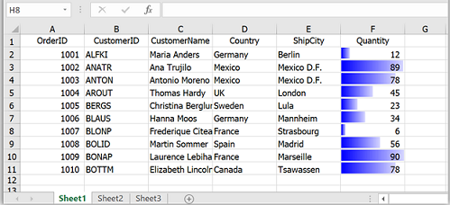

# How to Apply the Conditional Format for Excel Sheet Exported from WPF DataGrid?

This example illustrates how to apply the conditional formatting to the exported excel in [WPF DataGrid](https://www.syncfusion.com/wpf-ui-controls/datagrid) (SfDataGrid).

`DataGrid` does not provide direct support to the conditional formatting while exporting from the grid to excel sheet. But you can achieve this by applying the conditional formatting to the exported worksheet. 

```c#
 var options = new ExcelExportingOptions();
 options.ExcelVersion = ExcelVersion.Excel2013;
 var excelEngine = sfDataGrid.ExportToExcel(sfDataGrid.View, options);
 var workBook = excelEngine.Excel.Workbooks[0];
 //Apply conditional format to worksheet
 IWorksheet worksheet = workBook.Worksheets[0];
 IConditionalFormats formats = worksheet["F2:F11"].ConditionalFormats;
 IConditionalFormat format = formats.AddCondition();
 format.FormatType = ExcelCFType.DataBar;
 IDataBar dataBar = format.DataBar;
 dataBar.BarColor = Color.Blue;
 workBook.SaveAs("Sample.xlsx");

```



Take a moment to peruse the [Excel To Export Customization](https://help.syncfusion.com/wpf/datagrid/export-to-excel#customize-exported-workbook-and-worksheet) documentation for more information.
